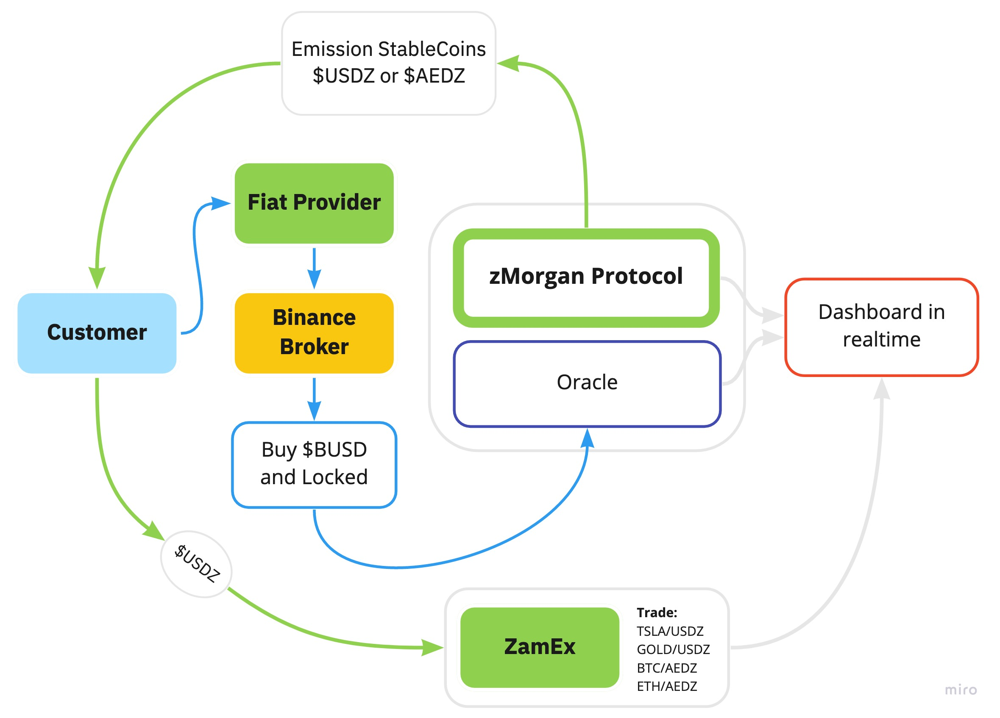

# USDZ stablecoin

BEP20 token with governance features

Stablecoins are cryptocurrencies backed by reserve assets for everyday use. They are designed to combine features such as instant processing, security, and privacy of blockchain technology, with the stability of reserve assets or leading Fiat currencies. 

USDZ is a stablecoin pegged to BUSD. Zamzam is developing such stablecoins as a universal solution for payments, remittance, banking, trading, and many other business applications.  

## Features
- Price Stability: USDZ achieve their price stability via collateralization. 1 USDZ will always be worth 1 BUSD respectively. 
- Instant Processing: Stablecoin transactions are processed and settled inside the ecosystem in real-time.
- Transparency. All collateral assets backing USDZ are deposited in escrow accounts with a real-time dashboard showing the value of collateralization and circulation of each so that our stablecoin collateral value is absolutely transparent to everyone.

## Utility
- Settlement medium
- Cross-border remittance
- Payments
- Easy access to Crypto Capital Markets
- Store of value
- Banking: lending, borrowing, investment

## Stablecoin as a Service

Stablecoin as a service is a universal solution for businesses and governments to quickly and efficiently issue their own stable cryptocurrency tied to a reserve asset or Fiat.

- For companies: Businesses can release their own branded digital tokens to offer incentives for their customers, build customer loyalty and encourage money to be kept within their ecosystem.

- For Governments: Central Banks can issue digital currencies (CBDC) that can be used as a digital national currency. With CBDC stablecoins, citizens retain access to the safest form of money - a claim on a central bank. This could promote diversity in payment options, make cross-border payments faster and cheaper, increase financial inclusion and facilitate fiscal transfers in times of economic crisis.

Official documentation - https://docs.zam.io/ecosystem-1/stablecoins-aedz-and-usz